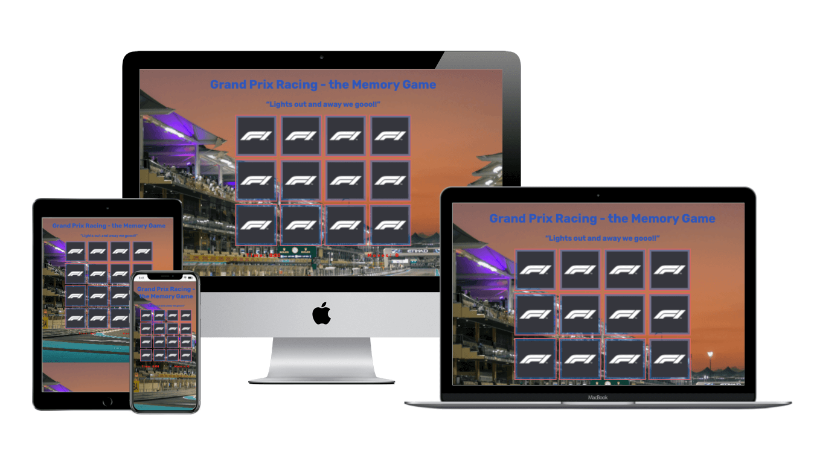

## Table of Content
----
* [Purpose](#Purpose)
* [User Experience Design (UX)](#User-Experience-Design)
 * [User stories](#User-stories)
  * [External users goal](#External-users-goal])
   * [Site owner's goal](#Site-owner's-gaol)
  * [Structure](#Structure)
  * [Design](#Design)
    * [Colour Scheme](#Colour-Scheme)
    * [Typography](#Typography)
    * [Imagery](#Imagery)
    * [Wireframes](#Wireframes)
  * [Features](#Features)
  * [Features Left to Implement](#Features-Left-to-Implement)
* [Technologies](#Technologies)
* [Testing](#Testing)
* [Note](#Note)
* [Deployment](#Deployment)
* [Credits](#Credits)
* [Acknowledgements](#Acknowledgements)

# Milestone 2

## Purpose
----
  This memory game was created for the sole purpose of completing the Milestone 2
  Project for the Code Institute’s Full Stack Developer course. It was built using the
  knowledge gained from the HTML, CSS and JavaScript (User Centric Design / interactive frontend development modules). A full
  list of technologies used can be found in the technologies section of this
  document.

A live version of game can be found [here]()

### Grand Prix Racing - the Memory Game

## User Experience Design

  ### User Stories
  * The user will se a popup with information on how to play the game. 
  * The user will be able to choose one of three levels  of difficulty before the game starts.
  * The user should see the current time elapsed and moves while playing the game.
  * The user should see an background image of the Yas marina formula 1 circuit.
  * The user should be able to click any of the cards which are facing down to flip it over and try to find the matching pairs.
  * The user should be able to find pairs by clicking on the cards. If the match, they stay flipped, if they don't match they will flip back.
  * The user should not be able to click on a new card until the two already flipped cards which are not matching and not flipped back.
  * The user should be receiving a message at completion of game.

 ### External users goal
 * Have fun playing the game.
 * Give the short time memory a workout while having fun.

  ### Site owner's goal
 * Have fun playing the game.
 * Give the short time memory a workout while having fun.

### Structure 

* The game header will be vissible at all times, during and after game. The header is the name of the game (Formula 1 "rand prix racing" the Memory Game)

* Background image will be vissable at all times, during and after game.

* The start page will include a pop-up with explanation on how to play the game, and three buttons to choose difficulty level of game.

* Custom CSS will be used to make the game responsive by the use of media queries
* All pages will be responsive and the layouts will change dependent on screen size. This is to ensure content flow is appealing, images are displayed properly and that the content is not shrunk side by side, so small that it is unreadable. The purpose of this is to fulfill user story:

* All pages will contain a Footer section with time elapsed and amout of moves made by the user. The aim of the Footer elements is to fulfill user stories.

* HOW TO PLAY THIS GAME: you complete the game by matching the cards. You do that by clicking on the cards. If they match they stay flipped, if they don't match they will flipp back 
to the starting position.

### Design

#### Colour Scheme
The main colours used are shade of Red rgb(248, 94, 94) Two shade of Blue rgba(39, 109, 189, 0.5), #2d56bd,shade of gray #555, shade of orange #fda40d and White #fff. 

#### Typography

The font used throughout the game is the Rubik font, Montserrat and Sans-serif is the fallback font in case for any reason the font isn’t being imported into the site correctly.

### Features
---
#### Existing Features
  * Three difficulty levels to choose from.
  * Time elapsed while playing the game, and a moves counter so that the playe knows how many moves took to complete the game.
  * A restart game button when game is completed.
#### Features Left to Implement
  * A "quit button" incase a the player want quit while playing the game
  ---

  ### Technologies
  ---
  ####	HTML
  * This project uses HTML as the main language used to complete the structure of the game.
  #### CSS 
  * This project uses custom written CSS to style the game.  

  #### [jQuery](https://jquery.com)
   * jQuery library was used to simplify HTML DOM tree traversal and manipulation

 #### [Google Fonts ](https://fonts.google.com/)   
   *  Google fonts are used throughout the project to import the Montserrat and Poppins fonts.
#### [Gitpod](https://www.gitpod.io)
   *  Gitpod is the Integrated Development Environment used to develop the Website.
#### [Github](https://github.com/)
   * GithHub is the hosting site used to store the source code for the Website and [Git Pages](https://pages.github.com/) is used for the deployment of the live site.
#### [Git](https://git-scm.com/)
  *  Git is used as version control software to commit and push code to the GitHub repository where the source code is stored.
#### [TinyJPG](https://tinypng.com/)
  *  TinyJPG is used to reduce the file sizes of images before being deployed to reduce storage and bandwidth.

#### [Png2jpg](https://png2jpg.com/) 
  * Png2jpg is used to change the format of an image from Png to jpg
#### [Squoosh](https://squoosh.app/)
  * Squoosh is used to reduce the file sizes of images before being deployed to reduce storage and bandwidth.
#### [Google Chrome Developer Tools](https://developer.chrome.com/docs/devtools/)
   * Google chromes built in developer tools are used to inspect page elements and help debug issues with the site layout and test different CSS styles.

#### [Timer](https://www.w3schools.com/howto/howto_js_countdown.asp) 
 * Code used to create timer was taken from w3school
#### [Balsamiq Wireframes](https://balsamiq.com/)
  *  This was used to create wireframes for 'The Skeleton Plane' stage of UX design.
#### [Techsini](http://techsini.com/multi-mockup/index.php)
   * tecnisih.com Multi Device Website Mockup Generator was used to create the Mockup image in this README.md

# Deployment

### Project Creation  
  * The project was started by me navigating GitHub.com and then i clicked on my repositories. I then clicked on botton for [new repository.](https://github.com/new)  
  * After that I clicked on the drop-down menu and clicked on [Code-Institute-Org/gitpod-full-template.](https://github.com/Sonicbasedrop/GitPod-full-template#readme) I then gave my repository a name (f1-the-memory-game).  
  * I checked ‘Public’-botton. 
  * Opening a the terminal in Gitpod, I then added my asset folders, CSS folder Images folder Js folder etc etc. The following commands were used throughout the project:
  * git add . - This command was used to add files to the staging area before committing.
  * git commit -m commit message explaining the updates - This command was used to commit changes to the local repository.
  * git push - This command is used to push all committed changes to the GitHub repository.

## Using Github Pages  
* 1. Navigate to the [GitHub Repository:](https://sonicbasedrop.github.io/f1-the-memory-game/)
* 2. Click my current repository. 
* 3. Click on the 'Settings' Tab.
* 4. Click on the Git Hub Pages Heading.
* 5. Select 'Master Branch' as the source.
* 6. Click the Save button.
* 7. Click on the link to go to the live deployed page